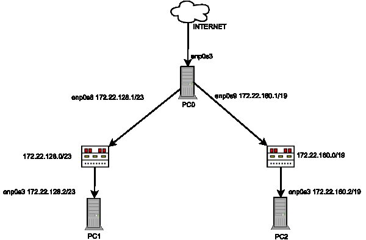

Zadanie 1
---------

1. Zaprojektuj oraz przygotuj prototyp rozwiązania z wykorzystaniem oprogramowania ``VirtualBox`` lub podobnego. 
Zaproponuj rozwiązanie spełniające poniższe wymagania:
   * Usługodawca zapewnia domunikację z siecią internet poprzez interfejs ``eth0`` ``PC0``
   * Zapewnij komunikację z siecią internet na poziomie ``LAN1`` oraz ``LAN2``
   * Dokonaj takiego podziału sieci o adresie ``172.22.128.0/17`` aby w ``LAN1`` można było zaadresować ``500`` adresów natomiast w LAN2 ``5000`` adresów    
   * Przygotuj dokumentację powyższej architektury w formie graficznej w programie ``DIA``
 
Rozwiązanie
-----------
LAN1 - 172.22.128.0/23  
LAN2 - 172.22.160.0/19 

PC0  
-------------------
|  interfejs   | adres  |
|:-------------| :------| 
| eth3 | internet od usługodawcy  |
| eth8 | 172.22.128.1/23  |
| eth9 | 172.22.160.1/19  |

PC1  
----------------
|  interfejs   | adres  |
|:-------------| :------| 
| eth3 | 172.22.128.2/23 |

PC2  
------------------
|  interfejs   | adres  |
|:-------------| :------| 
| eth3 | 172.22.160.2/19 |

użyte komendy:  
``ip addr add *** dev ***`` - PC0, PC1, PC2   
``ip link set *** up`` - PC0  
``ip route add default via *** dev ***`` - PC1, PC2  
``echo 1 > /proc/sys/net/ipv4/ip_forward`` / ``sysctl -w net.ipv4.ip_forward=1`` - PC0  
``iptables -t nat -A POSTROUTING -s *** -o *** -j MASQUERADE`` - PC0  

*** - ip/nazwa

Całość została przetestowana komendą ``ping google.pl``na wszystkich PC.   

<b>Podział sieci: </b>  
172.22.128.0/17    
LAN1  

Aby otrzymać 500 podsieci, należy pożyczyć z części hosta 2^n >= 500, n = 9, czyli 17+9 = 26  
255.255.11111111.11000000  
255.255.255.192  
2^6-2 hostów, czyli 62 hostów  

Przykłady:  

|Nr podsieci    |     Adres podsieci    |          Zakres hostów                     |           Broadcast         |
|---------------|-----------------------|--------------------------------------------|-----------------------------|
|     1         |   172.22.128.0/26     |   172.22.128.1 - 172.22.128.62             |          172.22.128.63      | 
|     2         |   172.22.128.64/26    |   172.22.128.65 - 172.22.128.126           |          172.22.128.127     |
|     3         |   172.22.128.128/26   |   172.22.128.129 - 172.22.128.190          |          172.22.128.191     |

  

LAN2  

Aby otrzymać 5000 podsieci, należy pożyczyć z części hosta 2^n >= 5000, n = 13, czyli 17+13 = 30  
255.255.11111111.11111100  
255.255.255.252  
2^2-2 hostów, czyli 2 hostów  

Przykłady:  

|Nr podsieci    |     Adres podsieci    |          Zakres hostów                     |           Broadcast         |
|---------------|-----------------------|--------------------------------------------|-----------------------------|
|     1         |   172.22.128.0/26     |   172.22.128.1 - 172.22.128.2              |          172.22.128.3       | 
|     2         |   172.22.128.4/26     |   172.22.128.5 - 172.22.128.6              |          172.22.128.7       |
|     3         |   172.22.128.8/26     |   172.22.128.9 - 172.22.128.10             |          172.22.128.11      |

  

<b>Forma graficzna: </b>  

